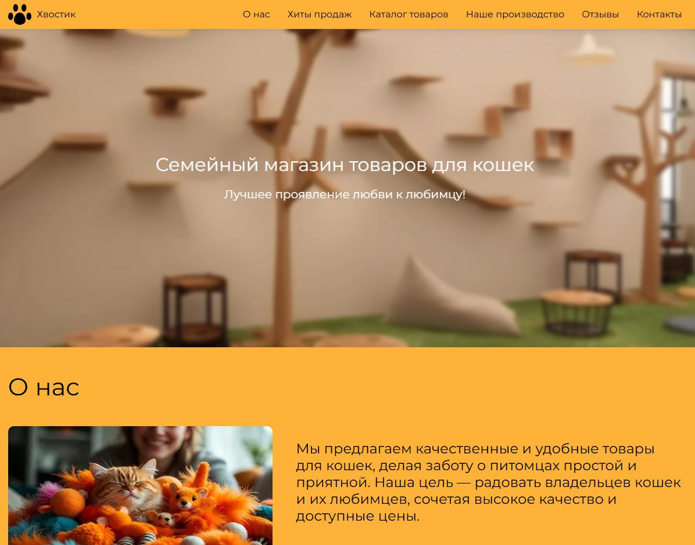
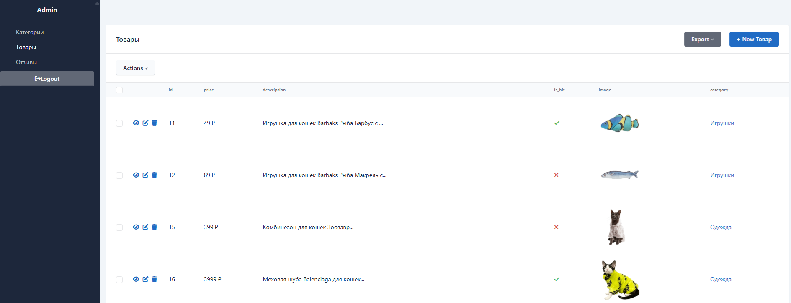
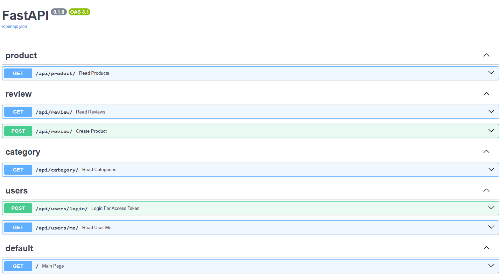

# Хвостик 🐱

Веб-сайт для семейного магазина товаров для кошек с административной панелью и REST API.

> **Слоган:** Лучшее проявление любви к любимцу!

## 📋 Описание

Одностраничный сайт-визитка с полноценным backend на FastAPI. Проект включает информационные разделы о компании, каталог товаров, систему отзывов и защищенную административную панель для управления контентом.

## 🛠 Технологический стек

### Backend


- **FastAPI** — современный async веб-фреймворк
- **SQLModel** — ORM для работы с БД (поддержка любых реляционных СУБД)
- **SQLAdmin** — административная панель
- **Pydantic** — валидация данных
- **PyJWT** — аутентификация через JWT-токены
- **Passlib** — хеширование паролей
- **Fastapi-storage** — управление загрузкой файлов
- **Jinja2** — шаблонизация HTML

### Frontend


- **HTML/CSS/JavaScript** (Vanilla JS)
- **Figma** — разработка дизайн-макета
- Адаптивная верстка

### Database


- **SQLite** (в разработке) — легко заменяется на PostgreSQL/MySQL благодаря SQLModel

### Tools & Environment


## ✨ Функциональность

### Публичная часть
- 📄 **Одностраничный сайт** с разделами: О нас, Хиты продаж, Наше производство, Отзывы, Контакты
- 🛍️ **Динамический каталог товаров** — загрузка через API (`/api/product/`)
- 💬 **Система отзывов** — пользователи могут оставлять отзывы через форму
- 📱 **Responsive дизайн** с фирменным оранжевым цветом

### Административная панель
- 🔐 **JWT-аутентификация** с хешированием паролей
- ➕ **CRUD операции** для товаров, категорий и отзывов
- 📤 **Загрузка изображений** товаров через fastapi-storage
- 🎨 Интеграция через SQLAdmin

## 🗂 Структура проекта
```
XBOCTUK/
├── admin/              # Административная панель
│   ├── auth.py        # Настройка аутентификации SQLAdmin
│   └── views.py       # View-классы для моделей
├── core/              # Ядро приложения
│   ├── config.py      # Конфигурация из .env
│   └── security.py    # JWT и хеширование паролей
├── routers/           # API эндпоинты
│   ├── category.py    # GET /api/category/
│   ├── product.py     # GET /api/product/
│   ├── review.py      # GET, POST /api/review/
│   └── user.py        # POST /api/users/login/, GET /api/users/me/
├── static/            # Статические файлы
│   ├── images/        # Изображения (товары и контент)
│   ├── script.js      # Frontend логика
│   └── style.css      # Стили
├── templates/
│   └── index.html     # Основной шаблон (Jinja2)
├── database.py        # Подключение к БД
├── main.py            # Точка входа FastAPI
├── seed.py            # Заполнение БД демо-данными
└── requirements.txt
```

## 🗄 Модели данных

### Product (Товар)
```python
- id: int
- price: Decimal
- description: str
- brand: str | None
- country: str | None
- material: str | None
- animal_age: str | None
- image: FileType
- category_id: int (FK)
- is_hit: bool  # Отображение в "Хитах продаж"
```

### Category (Категория)
```python
- id: int
- title: str
- text: str
- products: Relationship
```

### Review (Отзыв)
```python
- id: int
- username: str
- email: str
- text: str
```

### User (Администратор)
```python
- id: int
- username: str
- hashed_password: str
- is_admin: bool
```

## 🚀 API Endpoints

| Метод | Endpoint | Описание |
|-------|----------|----------|
| GET | `/api/product/` | Получить все товары |
| GET | `/api/category/` | Получить все категории |
| GET | `/api/review/` | Получить все отзывы |
| POST | `/api/review/` | Создать новый отзыв |
| POST | `/api/users/login/` | Авторизация (JWT) |
| GET | `/api/users/me/` | Получить данные текущего пользователя |

> **Примечание:** API спроектирован с возможностью расширения до полноценного REST сервиса

## 🔐 Безопасность

- **JWT-токены** для аутентификации администраторов
- **Хеширование паролей** через bcrypt (passlib)
- **Переменные окружения** (.env) для чувствительных данных:

## 📦 Установка и запуск

1. **Клонировать репозиторий**
```bash
   git clone https://github.com/kuramagod/XBOCTUK.git
   cd XBOCTUK
```

2. **Создать виртуальное окружение**
```bash
   python -m venv venv
   source venv/bin/activate  # Linux/Mac
   venv\Scripts\activate     # Windows
```

3. **Установить зависимости**
```bash
   pip install -r requirements.txt
```

4. **Настроить .env файл**
```bash
   cp .env.example .env
   # Заполнить переменные окружения
```

5. **Запустить сервер**
```bash
   uvicorn main:app --reload
```

Приложение будет доступно по адресу: `http://localhost:8000`

Административная панель: `http://localhost:8000/admin`

API документация (Swagger): `http://localhost:8000/docs`

## 🎨 Дизайн

### Сайт



### Админ панель



### Документация Swagger UI



[Макет в Figma](https://www.figma.com/design/r1lidM8Qpm4KNJwBgNdLLI/csite?node-id=55-54&p=f&t=osOdHwBi8FuDXtkZ-0)

## 🏗 Архитектурные решения

- **Разделение на слои:** роутеры, модели, core-логика
- **SQLModel:** единая декларация Pydantic-схем и SQLAlchemy-моделей
- **Гибкость БД:** легкая замена SQLite на PostgreSQL/MySQL без изменения кода
- **Расширяемость:** структура проекта позволяет добавить полный CRUD API с минимальными изменениями
- **Jinja2 + Fetch API:** гибридный подход для рендеринга (статика + динамика)

## 📝 Возможности для расширения

- [ ] Полноценный CRUD API для всех сущностей
- [ ] Система ролей пользователей (покупатели/администраторы)
- [ ] Корзина и оформление заказов
- [ ] Пагинация и фильтрация товаров
- [ ] Интеграция платежных систем
- [ ] Миграции БД (Alembic)

## 📄 Лицензия

Учебный проект
